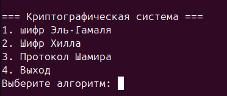
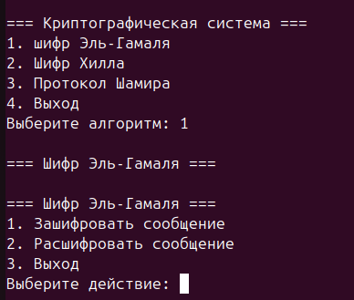
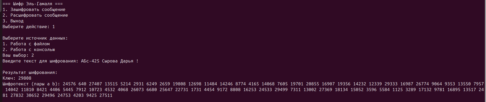
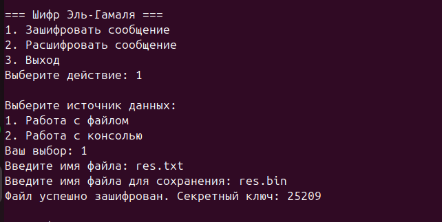

# Расчетно-графическая работа по программированию
Проект первого курса

Консольное приложение на С++ для системы Linux, которое демонстрирует работу нескольких алгоритмов шифрования с использованием ввода с консоли и работы с файлами


## Описание

Приложение представляет собой интерфейс и реализацию трех криптографических алгоритмов:

* **Шифр Эль-Гамаля** - метод ассиметричный шифрования, основанный на дискретном логарифмировании.
* **Шифр Хилла** - Полиграммный шифр подстановки, основанный на принципах линейной алгебры и модульной арифметики.
* **Протокол Шамира** - метод шифрования без передачи ключей по открытому каналу связи.

Приложение позволяет:
* Шифровать и дешифровать текст, вводимый с клавиатуры.
* Шифровать и дешифровать файлы.

Исходный код и скриншоты находятся в данном репозитории.

## Возможности

* **Понятный интерфейс**: Разделение операций для текста и файлов.
* **Поддержка нескольких алгоритмов**: протокол Шамира, шифр Хилла и Эль-Гамаля.
* **Операции с текстом**:
    * Выбор алгоритма.
    * Ввод текста для шифрования/дешифрования.
    * Шифрование/дешифрование текста выбранным алгоритмом.
    * Вывод зашифрованного/дешифрованного текста.
* **Операции с файлами**:
    * Выбор файла.
    * Шифрование/дешифрование файла выбранным алгоритмом.
    * Сохранение зашифрованного/расшифрованного файла.
    * Предложение создать файл для шифрования/дешифрования при необходимости.
* **Обратная связь**: Информационные сообщения о статусе операций и ошибках(если они есть).\

## Стек технологий

* **C++**: Основной язык реализации криптографических алгоритмов.
* **Динамические библиотеки** (.so)
* **CMake**: Сборка проекта
* **Cpack**: Установщик для DEP, EXE пакетов  
* **Linux**: Целевая ОС (тестировалось на Ubuntu)

##  Скриншоты

Ниже представлены скриншоты основных меню и этапов работы приложения.

**1. Главное меню**




**2. Меню выбора алгоритма**




**3. Пример шифрования текста**




**3. Пример шифрования файла**




## Структура проекта

* `main.cpp`: Точка входа приложения (главное меню выбора алгоритмов).

**Core Components**:  
* `common.h`: Общие утилиты (безопасный ввод, работа с файлами).  

**Algorithms (C++ Implementations)**:  
* `gaml.cpp/.h`: Реализация шифра Эль-Гамаля.  
* `hill.cpp/.h`: Реализация шифра Хилла.  
* `shamir.cpp/.h`: Реализация протокола Шамира.  

**Dynamic Libraries**:  
* `libElGamal.so`: Скомпилированная библиотека для Эль-Гамаля.  
* `libHillCipher.so`: Скомпилированная библиотека для шифра Хилла.  
* `libShamirProtocol.so`: Скомпилированная библиотека для протокола Шамира.  

**Build System**:  
* `CMakeLists.txt`: Конфигурация сборки (исполняемый файл + динамические библиотеки).


## Установка и запуск

1.  Клонируйте репозиторий: https://github.com/Dasha1515/crypto_project
    ```bash
    
    ```
2.  Соберите проект
    ```bash
    mkdir build && cd build
    cmake ..
    make
    ```
3.  Соберите проект
    ```bash
    ./CryptoMain
    ```
